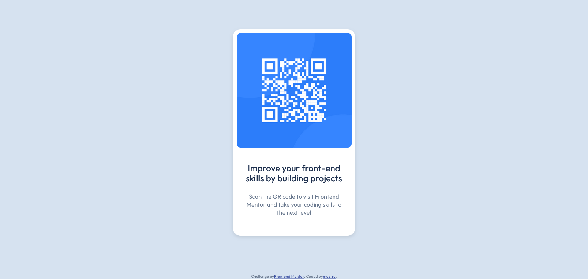

# Frontend Mentor - QR code component solution

This is a solution to the [QR code component challenge on Frontend Mentor](https://www.frontendmentor.io/challenges/qr-code-component-iux_sIO_H). Frontend Mentor challenges help you improve your coding skills by building realistic projects. 

## Table of contents

- [Overview](#overview)
  - [Screenshot](#screenshot)
  - [Links](#links)
  - [Built with](#built-with)
  - [What I learned](#what-i-learned)
  - [Continued development](#continued-development)
- [Author](#author)

## Overview

This project is the first of hopefully many that I do for frontendmentor.

### Screenshot

### Links

- Solution URL: [Add solution URL here](https://your-solution-url.com)
- Live Site URL: [https://mactru.github.io/qr-code-component-main/](https://mactru.github.io/qr-code-component-main/)

### Built with

- HTML
- CSS
- Flexbox

### What I learned

During this challenge I was getting comfortable with the frontend mentor website and this served as the perfect tutorial for that.

### Continued development

I'd like to learn more about CSS Grid as I tend to try to solve every problem with Flexbox, and also focus on a mobile-first mindset.

## Author

- Frontend Mentor - [@mactru](https://www.frontendmentor.io/profile/mactru)
- Github - [@mactru](https://github.com/mactru)